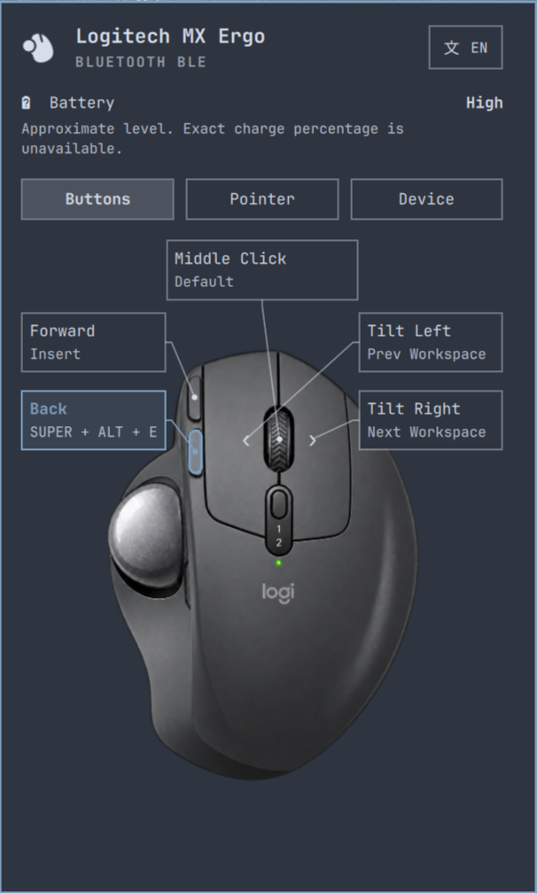

# Logitech MX Ergo Trackball Plugin for Omarchy Quattro

> **Status: Work in progress / В разработке.** This is a development snapshot, not a stable release. The manifest currently reports `1.0.0`; that number does not indicate production readiness. See [known limitations](#known-limitations) before trying it.

A hardware plugin for Omarchy Quattro shell designed for the **Logitech MX Ergo** multi-device wireless trackball connected via Bluetooth BLE or Logitech Unifying Receiver.



## Features

- **Native Battery Services:** Reactive battery state from Quickshell UPower and Bluetooth. Kernel metadata identifies the selected MX Ergo.
- **Battery Reporting:** Shows the reported level (High, Normal, Low, or Critical), Charging, or Charge unknown when no level is available. A short hint identifies the level as approximate. No filled battery gauge or synthetic percentage is displayed.
- **Device Matching:** Bluetooth batteries must match the selected device address. A sole MX Ergo on Unifying is selected when there is no active Bluetooth link; a cached BLE battery is never treated as a receiver connection.
- **Hardware Button Mapping:** Configures actions for 5 trackball buttons (`mouse:275`, `mouse:276`, `mouse:274`, `mouse:278`, `mouse:279`) with action catalog (Workspaces, Overview, Window control, Audio mute).
- **Experimental Low-Latency Mode:** Optional kernel BLE connection parameter tuning (`conn_min_interval: 6`, `conn_max_interval: 9`) and USB autosuspend settings. Actual input rate and latency have not been measured.
- **Settings Persistence:** Button mappings and pointer preferences are saved to `$XDG_CONFIG_HOME/omarchy/mx-ergo.json` (default: `~/.config/omarchy/mx-ergo.json`). Writes are serialized and atomically replace the file; failures leave the previous file intact. Loading is capped at 64 KiB and validates types, ranges and action names. Invalid preferences are not applied. Read, write and settings-application failures appear in the panel; failed saves or applications have an explicit Retry action.
- **Theme Changes:** After Hyprland reloads its configuration, the plugin reapplies current settings through its native `configreloaded` event. One managed helper applies the settings and verifies button keys, descriptions, and removed default mappings in Hyprland. Failures receive at most three attempts with 2- and 4-second delays; each command has a 5-second timeout. Changes made while an attempt is running replace the pending request. Verification failures appear in the panel and shell log. This does not continuously monitor mappings removed later by another application, or prove what originally removed a mapping.
- **Button Diagram:** Select a physical button or its callout on the MX Ergo illustration to open its editor. Labels show current assignments; selection alone does not change mappings. Both wheel tilts and middle-click have separate targets.
- **Language Selector:** The header shows a translation symbol and the effective language code, including in automatic mode. The list uses native language names and highlights the selected preference. Tab reaches the picker and each language; Escape closes the list first. Unsupported Traditional Chinese locales fall back to English.
- **Panel Layout:** Three pages — Buttons, Pointer, and Device — use the same `Style.space(380)` width and Omarchy typography as ROG Cetra. Opening the panel starts at the centered button diagram. A button editor replaces the diagram; Back or Escape returns to it. Scrolling remains available on small screens and for long translations.
- **Explicit Editing:** Typing, recording, clearing, or composing a shortcut changes only the draft. Apply or Enter saves shortcuts and commands; leaving the editor discards unapplied drafts. Selecting a preset or Reset applies immediately. Every explicit choice (preset, Reset, Apply, or Enter) returns to the diagram with the edited button highlighted, ready to select another button. Tab moves through editor controls, including key chips.
- **Compact Status Indicator:** Trackball connection state and charging indicator in the Omarchy status bar.
- **Strict Uncertainty Handling:** Disconnected or sleeping states display explicit indicator glyphs without coercing unknown battery levels to 0%.
- **Hyprland Pointer Controls:**
  - Acceleration profile toggle: **Adaptive** vs **Flat** (Linear).
  - Sensitivity slider (`-1.0` to `+1.0`, step `0.05`) with a one-shot 250ms debounce.
  - Natural scrolling toggle.
  - Per-device pointer configuration applied directly to `logitech-mx-ergo-multi-device-trackball-`.
- **Pure Theme Integration:** 100% Omarchy theme tokens (`Color.*`, `Style.*`), automatically matching any active desktop palette.

## Architecture & Security Disclosure

- **Execution:** The plugin runs unsandboxed with the user's permissions inside the shared Omarchy shell. Button actions can execute commands and change Hyprland bindings.
- **Optional Privileges:** The plugin never elevates its own mutable scripts. The unprivileged client checks the installed helper and its ancestors for root ownership, safe modes and absence of symlinks. Explicit profile actions authorize only `/usr/local/libexec/omarchy-mx-ergo-bluetooth` through Polkit. A separate installation is required; the normal plugin works without it. The profile affects every device on the controller.
- **Kernel Metadata:** A native `FileView` reads each UPower device’s HID identity from `device/uevent`. Status remains in the native UPower and Bluetooth services. No raw `/dev/hidraw*` access.
- **Processes:** A bounded Python helper validates and atomically writes settings; optional controller diagnostics use Bash; pointer and button settings use `hyprctl eval`. The custom command field intentionally runs shell commands as the user. Shortcut operands are shell-quoted. No plugin network calls, downloads or remote builds are performed.
- **Monitoring:** Resume detection uses one managed `dbus-monitor` subscription restricted to the logind sender, path and sleep signal. An unexpected exit receives at most three retries, spaced by two seconds; a stopped listener is reported in the panel. Sleep cancels pending reconnect timers and the current settings helper; resume reapplies configured assignments. Battery changes arrive through native services; no battery polling process runs. Controller diagnostics run on panel open and after an authorized profile operation.
- **Strict Input Validation:** Hardware addresses are strictly validated against MAC address patterns before passing to Bluetooth brokers.

## Setup and development

Requires Omarchy Quattro, its Quickshell Bluetooth and UPower modules, BlueZ, UPower, and the Hyprland Lua interface used by this source. Runtime helpers include Python 3, `dbus-monitor`, and `hyprctl`. Some button actions additionally require `wtype`, `playerctl`, `wpctl`, Voxtype, the `moorgrove.overview` plugin, or the `io.github.hikari112.tts` plugin. Tests require Node.js, Python 3, Qt 6 `qmllint` and `qmltestrunner` (including QtTest and QtQuick.Shapes), and installed Omarchy shell sources.

For source inspection, clone outside the active plugins directory:

```bash
git clone https://github.com/PavelLizunov/omarchy-mx-ergo.git
cd omarchy-mx-ergo
```

Plugin assets and helpers resolve relative to their QML source; the checkout folder name is not significant. The Bluetooth address is blank by default: exactly one discovered device named MX Ergo is selected. Set `deviceAddress` explicitly when several devices match; pairing is performed through the normal Omarchy Bluetooth controls. Reconnect uses the known native BlueZ device; if it is absent, discover or pair it through those controls. Pointer configuration uses `hyprDeviceName`, which must match the name reported by `hyprctl devices`. Files copied into the active plugin directory may be discovered or reloaded by the running shell. Never change or reload an active plugin while the screen is locked or a lock is requested.

On the tested Omarchy host, a plugin rescan can reuse cached QML after a source edit. If an update appears ineffective, restart the shell once while unlocked with `omarchy restart shell` (the bar briefly disappears). Verify that `quickshell log -p /usr/share/omarchy/shell -t 50` contains `MX Ergo: model loaded with categorical battery display and Hyprland reload recovery`. Subsequent Hyprland configuration reloads should log `MX Ergo: restoring settings after Hyprland reload` and restore the mappings automatically.

The plugin ID is `io.github.pavellizunov.mx-ergo`. Use Omarchy's plugin controls to enable or disable it. Before removal, use **Restore original settings** and resolve any pending restoration. Removing the plugin alone does not uninstall the optional helper or remove its system configuration. Saved preferences remain in `~/.config/omarchy/mx-ergo.json`.

## Known limitations

- Text appearing over the plugin has been reported; the cause and fix are pending.
- Verified charge measurement is unavailable. Source reports are approximate and measurement time is unknown. The installed Quickshell API does not expose UPower’s `BatteryLevel`; the plugin uses recognized categorical icons and BlueZ reports. Neither source proves a fresh hardware measurement or battery health. An unchanged High level cannot rule out discharge.
- UPower association requires readable HID metadata and exactly one matching identity. Unknown or ambiguous identity is not guessed. Without an active Bluetooth link, a sole receiver-side MX Ergo can be selected by product ID; multiple receivers require an explicit HID serial in `deviceAddress`. The Bluetooth MAC cannot prove which receiver-side serial belongs to the same physical mouse. Wireless sleep/connection through a receiver is not independently verified.
- Pointer settings are per input device, but Hyprland button bindings are global: these five button codes and two horizontal-wheel aliases affect other pointing devices too. Applying settings replaces unmodified bindings for those codes. Disabling/removing the plugin does not immediately undo runtime bindings; reload the Hyprland configuration after disabling to restore configuration-defined mappings. Unsaved mappings from other programs cannot be recovered automatically.
- Several recorded shortcuts use compatibility aliases: Insert starts Voxtype, Super+Insert starts the voice agent, and Super+Alt+A/E/X/R calls the installed TTS plugin. Common Super workspace/window shortcuts use compositor dispatchers. Other shortcuts use `wtype`; these aliases are not discovered from your keyboard configuration. The TTS path follows `XDG_CONFIG_HOME` rather than an author home directory.
- Runtime lifecycle and compatibility across machines have not been verified for this publication.

Development tasks are tracked in [BACKLOG.md](BACKLOG.md).

## Optional Bluetooth latency profile

This changes controller defaults and USB autosuspend, not radio transmit power. No measured input rate or improvement in stuttering is guaranteed. Existing connections may retain their negotiated intervals. Battery, button mapping and pointer controls work without the optional helper.

### Installation (administrator action)

Review `system/omarchy-mx-ergo-bluetooth`, its Polkit policy, and `scripts/install-bluetooth-helper.sh` before running the installer from this checked-out version:

```bash
sudo ./scripts/install-bluetooth-helper.sh
```

The installer adds only a root-owned helper in `/usr/local/libexec` and `io.github.pavellizunov.mx-ergo.bluetooth.policy` in `/usr/share/polkit-1/actions`. It does not change Bluetooth settings, configure passwordless access, or start a daemon. Existing installations are refused rather than silently overwritten. The policy requires administrator authentication for the active session. Installing and updating administrator-owned code is a separate trust decision from enabling a user plugin.

### Operation and recovery

`scripts/low-latency.sh --status hci0` is read-only; use `-` when no adapter is available. It reports helper availability, saved profile state, and whether recovery is possible. The UI refreshes this on panel open. Unprivileged debugfs reads may be unavailable, so an installed profile can remain **Unable to verify** rather than falsely appearing applied. Authorization failures are shown separately from profile state.

- **Enable profile** saves the actual minimum/maximum interval and USB power mode once, then applies 6/9 interval units and USB `on`. Repeat enable never replaces the original baseline.
- The root-owned journal is `/var/lib/omarchy-mx-ergo/bluetooth.json`. A bounded udev invocation in `/etc/udev/rules.d/70-omarchy-mx-ergo-bluetooth.rules` reapplies an enabled profile when a Bluetooth adapter is added. It verifies physical USB port, vendor/product and serial (when provided), not just `hciN`. There is no persistent helper process. If debugfs is unavailable during the event, reapplication can fail; status reports that uncertainty.
- **Restore original settings** removes the owned activation rule first. If the original adapter is unavailable, the journal remains with **restore pending**; select Restore again after reconnecting it. Missing controls or reload failures retain recovery information. Values changed externally are not overwritten automatically.
- Errors during enable attempt restoration. Recovery information is removed only after original values and rule reload are verified. Root-owned files with unexpected contents, symlinks or insecure permissions are refused.
- One adapter profile is supported. Moving an adapter to another USB port requires recovery at the original port first. Devices without USB serial numbers cannot be distinguished from an identical replacement at the same physical port.

### Legacy profile migration

Older versions wrote `bluetooth-low-latency.conf` and `50-bluetooth-performance.rules` without saving original settings. **Remove old rules** explicitly deletes only recognized historical content and records that the original values are unknown. It does not invent a baseline or overwrite current controller values. Restart the computer before enabling a new profile; same-boot activation is refused. Unrecognized old files require manual review. Cleanup does not restart Bluetooth or disconnect the mouse automatically.

### Removing the optional helper

First restore the profile (or complete legacy cleanup and restart). Do not remove a pending recovery journal until the original adapter's settings have been restored. When the status is Off and there is no pending recovery, an administrator can remove the helper and its policy:

```bash
sudo rm -- /usr/local/libexec/omarchy-mx-ergo-bluetooth /usr/share/polkit-1/actions/io.github.pavellizunov.mx-ergo.bluetooth.policy
```

The inactive journal directory/lock can remain; neither executes code. Reinstalling or upgrading the helper requires deliberate administrator action. Privileged installation, actual udev hotplug behavior and controller writes must be verified separately on the target system; isolated tests are not a live security certification.

## Verification

```bash
./tests/run.sh
```

The suite checks the manifest, symlinks, colors, model contracts, locale completeness, QML lint, offscreen Qt interaction tests for the diagram, and lockscreen guard logic. Passing these checks does not verify live UI behavior. Model tests execute production JavaScript functions; component tests use Qt offscreen. See [release review](RELEASE-REVIEW.md) for the checked scope and remaining acceptance work.

## License

MIT License. Copyright (c) 2026 Pavel Lizunov.

The custom trackball icon uses the approved simplified B silhouette and the active theme color. See [icon details](assets/README.md).
